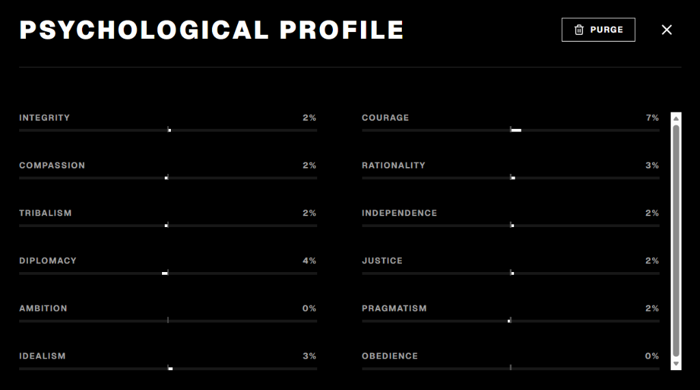
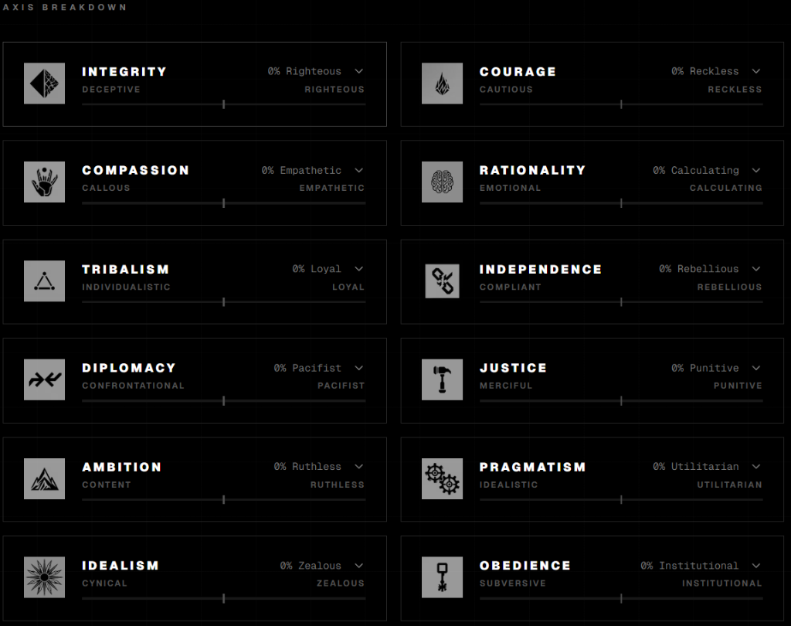

# 🖥️ FRACTURE — Deterministic Behavioral Simulation

FRACTURE is a retro-futuristic, clinical evaluation interface and deterministic branching narrative engine. It tests the user's moral alignment across 12 psychological axes through scenarios with branching decision paths, culminating in behavioral profile calculations and archetype classification.



---

## 📺 Interface & Aesthetics

The system is styled with a strict **retro brutalist clinical terminal** aesthetic:
- **CRT Bezel & Scanlines:** High-fidelity scanlines, phosphorescent flicker, and screen curvature mimic an authentic 1980s mainframe. Can be enabled/disabled as a unified screen filter.
- **Persistent Static Grain:** A low-opacity analog static noise overlay runs constantly in the background of active gameplay to maintain atmosphere without degrading readability. Can be toggled in settings.
- **Responsive Signal Glitches:** Random contrast shifts, skews, color rotations, inversions, and shaking simulate real signal interference. Glitches happen dynamically (every 4s to 15s) and trigger responsively with a **30% probability** on mouse clicks, providing tactile feedback when selections are made. Can be toggled in settings.
- **Generative Audio Drone:** An interactive synth drone generated using the **Web Audio API** plays in the background, deepening in pitch and texture as the user progresses deeper into scenario nodes.



---

## 🧠 Core Mechanics

### 1. Moral Calibration Survey
Upon powering on the console for the first time, users must complete a **6-question calibration baseline test**. It probes all 12 axes to create an initial profile. If a user tries to access `/profile` or `/game` directly on a fresh page load before completing this calibration, the system automatically redirects them back to the CRT onboarding terminal.

### 2. Branching Scenarios
Users select from multiple clinical scenarios. Decisions lead to immediate consequences and shape the overall outcome:
- **Decision Trail:** Visualizes the chronological tree path taken by the user.
- **Challenge Comparison:** Allows users to generate a shared link containing encoded base64 parameters. Sending it to a peer enables a side-by-side comparison of choices and differing outcomes.

### 3. Psychological Profiling & Archetypes
Upon completing 3 or more evaluation scenarios, the profile engine calculates the user's behavioral classification.
- **Behavioral Stability:** Measures decision pattern variance across scenarios to determine how predictable/consistent the user's actions are.
- **Baseline Alignment:** Measures the variance between the initial self-assessment calibration baseline and actual scenario decisions.
- **Axis Breakdown:** Center-origin sliders display shifts towards opposing trait poles.

---

## 📊 The 12 Behavioral Axes

| Icon | Axis | Left Pole | Right Pole |
| :---: | :--- | :---: | :---: |
|  | **Integrity** | Deceptive | Righteous |
|  | **Courage** | Cautious | Reckless |
|  | **Compassion** | Callous | Empathetic |
|  | **Rationality** | Emotional | Calculating |
|  | **Tribalism** | Individualistic | Loyal |
|  | **Independence** | Compliant | Rebellious |
|  | **Diplomacy** | Confrontational | Pacifist |
|  | **Justice** | Merciful | Punitive |
|  | **Ambition** | Content | Ruthless |
|  | **Pragmatism** | Idealistic | Utilitarian |
|  | **Idealism** | Cynical | Zealous |
|  | **Obedience** | Subversive | Institutional |

---

## 👥 Archetype Classifications

- 🩺 **The Surgeon:** Cuts cleanly. Removes emotion from logic.
- 🔥 **The Zealot:** Burns bright for a cause. Rejects compromise.
- 🌫️ **The Ghost:** Drifts through conflict. Free from bonds or tracks.
- 🗣️ **The Politician:** Directs statements to secure power.
- 🛡️ **The Martyr:** Sacrifices self for the pain of others.
- 🗝️ **The Warden:** Believes rules and structure are absolute safety.
- 🕳️ **The Nihilist:** Disbelief in systems and moral value.
- 🐺 **The Wolf:** The pack is sacred; outsiders are irrelevant.
- 🔦 **The Torch:** Illuminates institutional and hidden corruption.
- 📐 **The Architect:** Standardizes systems. Treats people as components.
- 🐑 **The Shepherd:** Guides and carries the weak, even when undeserving.
- ⛓️ **The Outlaw:** Lives outside systemic rules and structures.
- ⚖️ **The Arbitrator:** Resolves conflict with detached neutrality.
- 🤝 **The Devotee:** Merges with a cause, following rules for group survival.
- ✊ **The Rebel:** Subverts and aggressively tears down authorities.
- 🪞 **The Mirror:** Highly adaptive. Reflects the expectations of others.

---

## 🛠️ Getting Started

### Prerequisites
- Node.js (v18+)
- npm / yarn / pnpm

### Installation
1. Clone the repository:
   ```bash
   git clone https://github.com/cacheparadox/FRACTURE.git
   cd FRACTURE
   ```
2. Install dependencies:
   ```bash
   npm install
   ```
3. Run the development server:
   ```bash
   npm run dev
   ```
4. Open [http://localhost:3000](http://localhost:3000) in your browser.

### Building for Production
To build the application for deployment:
```bash
npm run build
npm run start
```
